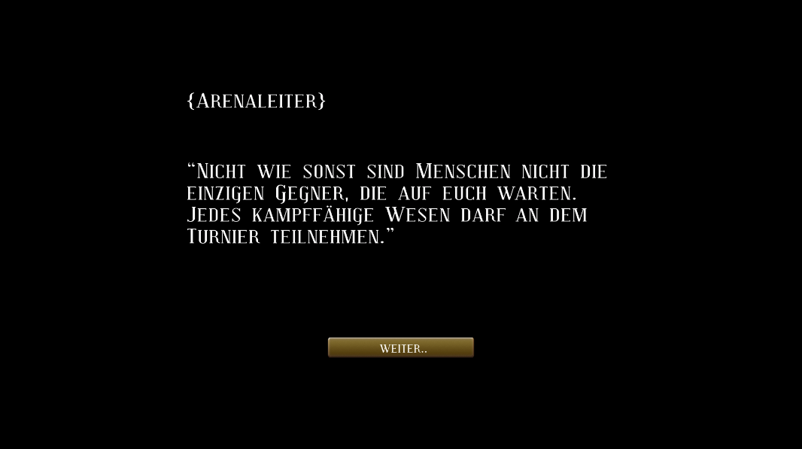

# Battle-Arena-Game
School project - A game made with Unity and C#

    
    
    
    
    
    
    
    
    
    
    
    
    
    
    
    
    
    
    
    
    

 
In the forth semester of my bachelor studies at the Beuth University of Applied Sciences a classmate and I developed our very first game with the framework Qt and in C++ called Submarine. For this project we had 3 weeks for the developing. The gameplay is simple, like in the game Space Invaders, enemies are floating down from the top trying to hit the player. The Player has to shoot the enemies to achieve points.
  
For game testing, we invited friends and family to play and test the game.
